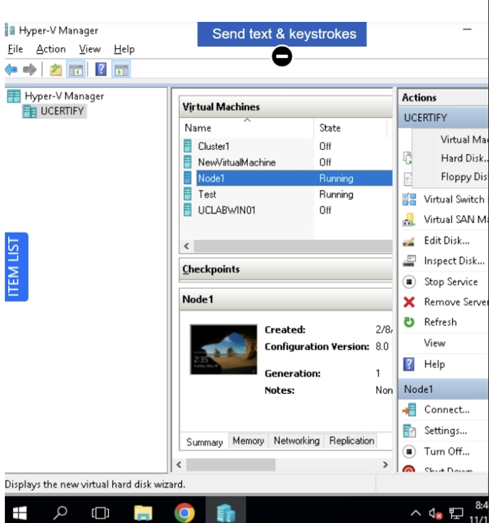
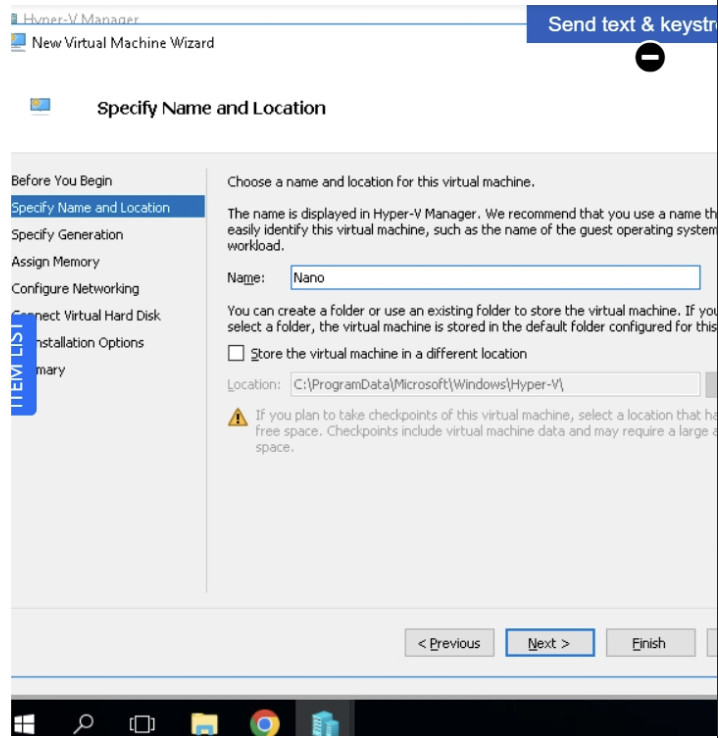
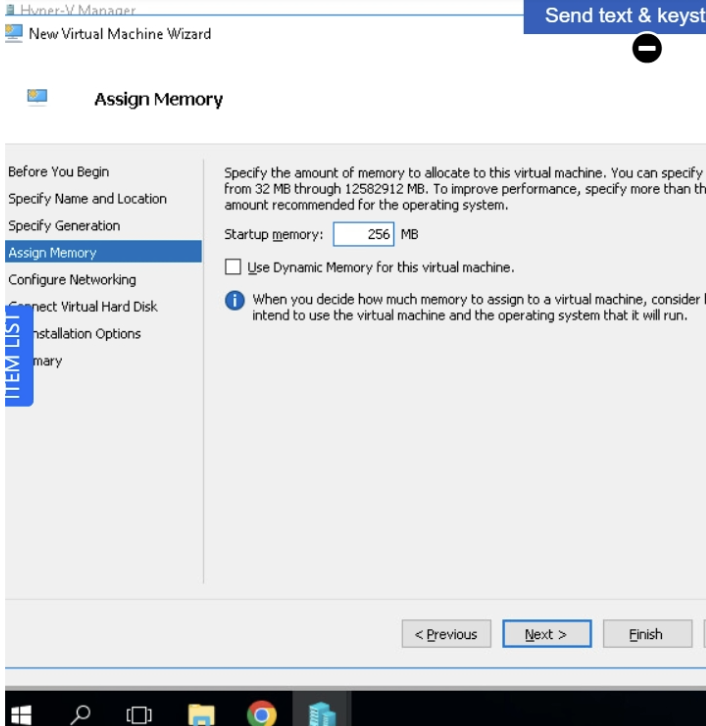
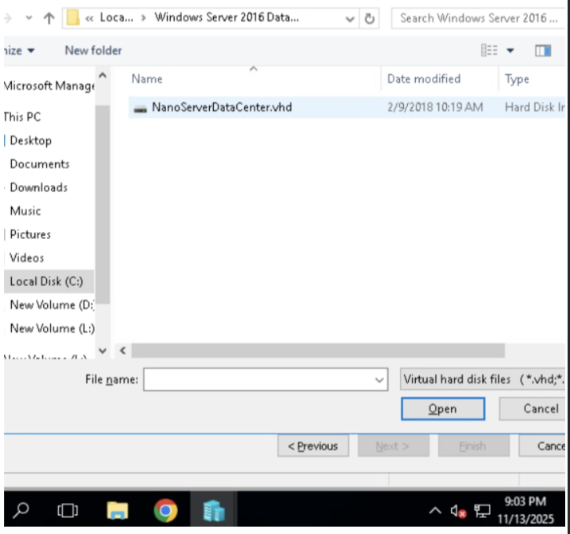

# Creating a Nano Server in a virtual machine
How to create a Nano Server in a virtual machine


<h2>Description</h2>
For this project, I provisioned Windows Nano Server in a virtual machine, showcasing my skills in deploying minimal, high-performance server solutions using virtualization. I used Windows PowerShell and Hyper-V on a Windows Server platform to complete the process.
<br />


<h2> Languages and Utilities Used</h2>

- <b>Utilities:

Windows PowerShell: Used for scripting, image creation, automation, and remote management throughout the Nano Server setup process.​

NanoServerImageGenerator module: Essential PowerShell module for building and customizing Nano Server VHD images.​

Hyper-V Manager (or VMware Workstation): Used for creating and configuring the virtual machine hosting Nano Server.​

DISM (Deployment Image Servicing and Management): Sometimes used to add packages/features to the Nano Server image.​

ZIP Tools: For extracting and copying binaries or image files during setup and deployment.​

Languages:

PowerShell Scripting: Core language for all automation, configuration, and management tasks in this project.</b> 


<h2>Environments Used </h2>

- <b>For this project, I used a Windows Server environment as the foundation, specifically leveraging Hyper-V Manager to create and run the Nano Server virtual machine. The image for Nano Server was prepared on a Windows Server 2016 (or newer) machine and deployed into a VM configured with at least 1,280 MB of RAM, as recommended for initial setup</b> 


<h2>Program walk-through:</h2>

<p align="center">
1.Open Hyper-V Manager: <br/>

<br />
<br />
  <b>Locate and launch Hyper-V Manager from your Windows Server or Windows client system.


2. Start Creating a New Virtual Machine

<br />
<br />Click New in the Hyper-V Manager sidebar.

Select Virtual Machine from the dropdown menu.

</b> 
3. Configure VM Basics:  <br/>
 <b>Rename the virtual machine  for easy identification.
 

Click Next repeatedly until you reach the memory setup section.

</b> 
4. Assign Memory <br/>
 <b>Type 256 MB in the Startup Memory box (as per instructions).
 

Click Next until you reach the Connect Virtual Hard Disk page.

</b> 
5. Connect Nano Server Virtual Hard Disk<br/>
 <b>Select Use an existing virtual hard disk.
 

Click Browse and navigate to your local disk > appropriate folder (e.g., Windows Server 2016 > NanoServer).

Select the NanoServer VHD file.


</b> 
6. Finish VM Setup<br/>
 <b>SClick Next, then Finish to complete the virtual machine creation.

Wait for the configuration/download process to finish.


</b> 
7.  Start and Access Nano Server VM <br/>
 <b>Select the new "Nano" VM in Hyper-V Manager.
 

Click Connect to open its virtual console.

Click Start and wait for the VM boot process to complete.


</b> 
8.  Initial Login and Password Setup<br/>
 <b>When prompted, enter the required credentials for Nano Server.
 

If logging in for the first time, you may be asked to change your password. Complete this step.


</b> 
9.  Access Management Tools<br/>
 <b>When prompted, enter the required credentials for Nano Server.
 

Minimize the VM window and launch a local or remote Windows PowerShell session.

This command lists all VM names in your Hyper-V environment, helping you confirm your Nano VM is active.


Click Next repeatedly until you reach the memory setup section.
<!--
 ```diff
- text in red
+ text in green
! text in orange
# text in gray
@@ text in purple (and bold)@@
```
